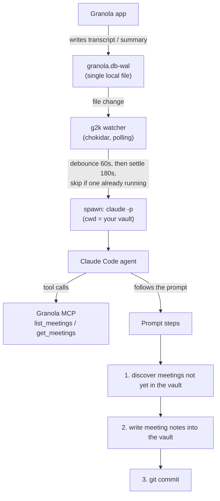

# g2k — Granola to Knowledge

Watch [Granola](https://granola.ai) for finished meetings and capture them into an
Obsidian vault using a `claude -p` agent that writes structured notes and commits them.

## Requirements

- macOS (Granola stores its cache locally on macOS)
- Node ≥ 20
- The [Claude Code](https://claude.com/claude-code) CLI (`claude`) on your PATH
- The Granola MCP authenticated once (see **Auth**)

## Install

```bash
npm install -g g2k
g2k init        # writes ~/.config/g2k/config.json
g2k auth        # one-time Granola MCP OAuth
g2k doctor      # verify everything is wired
g2k install     # install + load the launchd daemon
```

## Auth

g2k reads meetings through the Granola MCP from inside the spawned agent. Authenticate once:

```text
cd <your vault> && claude
/mcp            # approve `granola`, complete OAuth in the browser
```

The token persists in `~/.claude.json` and is reused headlessly. If captures start
timing out (`KILLED ... likely Granola MCP auth hang` in the logs), re-run the flow.

## Execution structure

g2k is a thin watcher that triggers a Claude Code agent; the agent does all the work.



**What calls what:**

1. **Granola** writes to its local write-ahead log, `~/Library/Application Support/Granola/granola.db-wal`, whenever it records a transcript or generates a summary.
2. **The g2k watcher** (`g2k watch`, run by the launchd daemon) watches that single file — by polling, so it survives the WAL being checkpointed/recreated. After the file goes quiet for `debounceMs` and then settles for `settleMs` (a meeting ended and Granola finished its summary), it fires **one** capture; triggers arriving while a capture is in flight are dropped.
3. **The capture** spawns `claude -p` with the working directory set to your vault. This matters: the Granola MCP is configured per-project in your vault's `.mcp.json`, so the agent only sees it when launched from the vault.
4. **The Claude Code agent** uses the **Granola MCP** (`list_meetings` / `get_meetings`) to fetch meeting data, then follows the prompt: discover meetings not already saved, write notes into the vault, and `git commit`.

g2k itself never touches Granola's API and never parses meeting data — it only watches a filename and shells out. If Granola moves its cache, point `watchFile` in the config at the new path.

## Configuration

Config lives at `~/.config/g2k/config.json`. See `config.example.json`. Point
`promptFile` at your own prompt to override the bundled generic one.

Key fields:

| Field | Meaning |
|---|---|
| `vaultPath` | Absolute path to your Obsidian vault |
| `watchFile` | The Granola file to watch (default: the WAL path above) |
| `promptFile` | Override prompt; `null` uses the bundled generic prompt |
| `commit` | Whether the agent should commit its changes |
| `timing.debounceMs` / `settleMs` | Silence then settle window before a capture fires |

## Commands

| Command | Description |
|---|---|
| `g2k init` | Create the config file interactively |
| `g2k config` | Print the resolved config |
| `g2k watch` | Run the watcher in the foreground |
| `g2k run` | Capture today's meetings once, now |
| `g2k install` / `g2k uninstall` | Manage the launchd daemon |
| `g2k doctor` | Health checks (incl. MCP reachability) |
| `g2k auth` | Print the Granola MCP auth instructions |

## Logs

`~/Library/Logs/g2k/watcher.log` and `watcher.err.log`.
